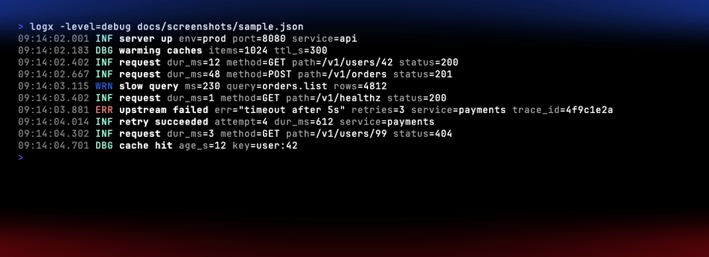
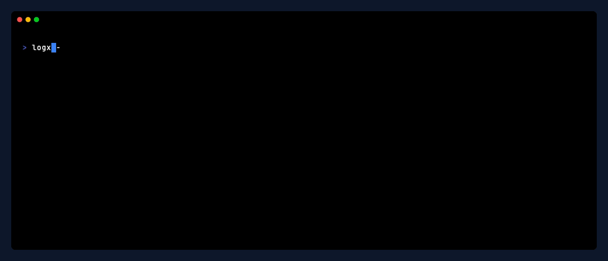

# GoLogX

> A small, fast, zero-dependency toolkit on top of Go's standard `log/slog`.
> Pretty colored output for humans, JSON for machines, file rotation, fan-out, and a companion CLI to pretty-print JSON logs from any pipeline.

[](https://github.com/AyoubTadlaoui/GoLogX/actions/workflows/ci.yml)
[](https://github.com/AyoubTadlaoui/GoLogX/actions/workflows/release.yml)
[](https://pkg.go.dev/github.com/AyoubTadlaoui/GoLogX/logx)
[](https://goreportcard.com/report/github.com/AyoubTadlaoui/GoLogX)
[](LICENSE)



`logx -f app.json` tailing a live JSON stream:

<!--
  Animated WebP renders as an  tag, which GitHub's README sanitizer
  passes through cleanly (it strips <video>). WebP plays in every modern
  browser including Safari. The MP4 and GIF copies are kept alongside
  for downloads (links below the image).
-->


<sub>Also available as [GIF](docs/screenshots/follow.gif) or [MP4](docs/screenshots/follow.mp4).</sub>

> Theme: [atlas-ragnarok](https://github.com/AyoubTadlaoui/atlas-ragnarok).
> The storm-fire glow is the actual atlas-ragnarok vignette — same colors,
> same geometry, same shader spec — implemented in 2D by
> `docs/screenshots/_vignette.py` and composited onto every frame.
> Regenerate with `sh docs/screenshots/gen.sh` (needs `vhs`, `ffmpeg`,
> `webp`, `pillow`).

---

## Why

`log/slog` is the right default in modern Go. But out of the box it ships only `TextHandler` and `JSONHandler`. For real use you often want:

- a **colored, human-readable** handler in development
- a **single record fanning out** to several sinks (pretty to stderr + JSON to file)
- **size-based file rotation** without pulling in a third-party dependency
- a **CLI** that pretty-prints JSON logs from any pipeline so you don't have to squint at machine output

GoLogX is those four things. Nothing more. Zero external dependencies.

---

## Install

### As a library

```bash
go get github.com/AyoubTadlaoui/GoLogX/logx@latest
```

### As a CLI

Pick whichever fits your machine:

```bash
# Homebrew (macOS + Linux)
brew install AyoubTadlaoui/tap/logx

# Scoop (Windows)
scoop bucket add atlas https://github.com/AyoubTadlaoui/scoop-bucket
scoop install logx

# WinGet (Windows, once Microsoft accepts the submission)
winget install AyoubTadlaoui.logx

# Arch Linux (via AUR)
yay -S logx-bin     # or: paru -S logx-bin

# Nix / NixOS
nix run github:AyoubTadlaoui/GoLogX            # one-shot
nix profile install github:AyoubTadlaoui/GoLogX # persistent

# Universal install script (Linux + macOS, amd64 + arm64) — verifies SHA256
curl -fsSL https://raw.githubusercontent.com/AyoubTadlaoui/GoLogX/main/install.sh | sh

# Debian / Ubuntu — pick the .deb from the releases page
sudo dpkg -i logx_0.1.6_linux_amd64.deb

# RHEL / Fedora / SUSE — pick the .rpm from the releases page
sudo rpm -i logx-0.1.6-1.x86_64.rpm

# Docker (linux/amd64, linux/arm64)
docker run --rm -i ghcr.io/ayoubtadlaoui/logx:latest < app.json

# Go install (any OS with Go ≥ 1.22)
go install github.com/AyoubTadlaoui/GoLogX/cmd/logx@latest

# Prebuilt binary
# https://github.com/AyoubTadlaoui/GoLogX/releases
```

Library use requires Go ≥ 1.22. See [`DISTRIBUTION.md`](DISTRIBUTION.md) for the full channel matrix and maintainer notes.

---

## Quickstart — library

```go
package main

import (
    "log/slog"
    "os"

    "github.com/AyoubTadlaoui/GoLogX/logx"
)

func main() {
    log := logx.New(logx.Options{
        Level:  logx.EnvLevel(slog.LevelInfo), // honors $LOG_LEVEL
        Format: logx.FormatPretty,
        Output: os.Stderr,
    })

    log.Info("server up", "port", 8080, "env", "prod")
    log.Warn("slow query", "ms", 230, "table", "users")
    log.Error("upstream", "err", "timeout", "retries", 3)
}
```

```text
21:10:27.036 INF server up port=8080 env=prod
21:10:27.120 WRN slow query ms=230 table=users
21:10:27.120 ERR upstream err=timeout retries=3
```

### Pretty to stderr + JSON to a rotating file

```go
rotator := &logx.RotatingWriter{
    Path:       "app.log",
    MaxSize:    1 << 20, // 1 MiB
    MaxBackups: 3,
}
defer rotator.Close()

multi := logx.NewMultiHandler(
    logx.NewPrettyHandler(os.Stderr, nil),
    slog.NewJSONHandler(rotator, &slog.HandlerOptions{
        Level:     slog.LevelInfo,
        AddSource: true,
    }),
)

log := slog.New(multi).With("service", "api")
log.Info("hit", "path", "/healthz")
```

Both sinks see the same record. A complete runnable version lives in [`examples/basic`](examples/basic).

---

## Quickstart — CLI

The `logx` binary reads JSON `slog` lines (from stdin or a file) and pretty-prints them.

```bash
# pipe a Go service's stderr
myapp 2>&1 | logx

# read from a file
logx app.log

# tail follow
logx -f /var/log/app.json

# filter
logx -level=warn -grep=timeout app.log

# no colors (for piping into a pager)
logx -no-color app.log | less
```

Lines that don't parse as JSON are passed through unchanged, so panic stacktraces and plain-text logs don't get swallowed.

All flags:

| Flag | Default | Meaning |
|---|---|---|
| `-level` | `debug` | Minimum level to show (`debug`/`info`/`warn`/`error`) |
| `-grep` | _empty_ | Only show lines containing this substring (applied to the raw input line, so it matches JSON-encoded fields and pass-through text alike) |
| `-f`   | `false` | Follow the file like `tail -f` (single file only) |
| `-no-color` | `false` | Disable ANSI color escapes |
| `-source` | `false` | Show `file:line` if `source` is present in the record |
| `-time`   | `15:04:05.000` | Go time format for the timestamp column |
| `-version` | — | Print version and exit |

---

## API surface

| Symbol | What it is |
|---|---|
| [`logx.New(opts)`](https://pkg.go.dev/github.com/AyoubTadlaoui/GoLogX/logx#New)                 | Build a `*slog.Logger` from `Options` |
| [`logx.NewHandler(opts)`](https://pkg.go.dev/github.com/AyoubTadlaoui/GoLogX/logx#NewHandler)   | Just the handler, for composition |
| [`logx.Default()` / `logx.Dev()`](https://pkg.go.dev/github.com/AyoubTadlaoui/GoLogX/logx#Default) | Opinionated production / development loggers |
| [`logx.NewPrettyHandler(w, opts)`](https://pkg.go.dev/github.com/AyoubTadlaoui/GoLogX/logx#NewPrettyHandler) | Colored, human-readable `slog.Handler` |
| [`logx.NewMultiHandler(h...)`](https://pkg.go.dev/github.com/AyoubTadlaoui/GoLogX/logx#NewMultiHandler)      | Fan one record out to N handlers |
| [`logx.RotatingWriter`](https://pkg.go.dev/github.com/AyoubTadlaoui/GoLogX/logx#RotatingWriter) | Size-based `io.WriteCloser` for slog (or any writer) |
| [`logx.LevelFromString(s)` / `logx.EnvLevel(fallback)`](https://pkg.go.dev/github.com/AyoubTadlaoui/GoLogX/logx#LevelFromString) | Wire log level via env / flag |

Full docs and examples: **[pkg.go.dev/github.com/AyoubTadlaoui/GoLogX/logx](https://pkg.go.dev/github.com/AyoubTadlaoui/GoLogX/logx)**.

---

## Performance

Microbenchmarks on `darwin/arm64`, single record with three attributes, output discarded:

```text
BenchmarkPretty-8        597.8 ns/op    16 B/op    1 allocs/op
BenchmarkPrettyColor-8   467.0 ns/op    16 B/op    1 allocs/op
BenchmarkStdlibText-8    592.2 ns/op     0 B/op    0 allocs/op
BenchmarkStdlibJSON-8    579.1 ns/op     0 B/op    0 allocs/op
BenchmarkMulti-8         829.7 ns/op    16 B/op    1 allocs/op
```

PrettyHandler is **on par with stdlib `TextHandler` / `JSONHandler`** in throughput, paying one small allocation per record for buffer pooling. Reproduce:

```bash
make bench
```

---

## Common tasks

```bash
make help        # list everything
make build       # build the cmd/logx binary into ./bin/logx
make test        # go test ./...
make test-race   # go test -race ./...
make bench       # microbenchmarks vs stdlib slog
make cover       # coverage profile + HTML
make lint        # golangci-lint run ./...
make snapshot    # build local snapshot archives with goreleaser (needs goreleaser)
```

---

## Versioning & releases

GoLogX follows [Semantic Versioning](https://semver.org/). While the project is `0.x`:

- The CLI is treated as stable for end users — flag names and exit codes won't change without a major bump.
- The library API may make minor changes between `0.x` releases. Anything breaking is called out in [CHANGELOG.md](CHANGELOG.md).

Tagged releases publish prebuilt CLI binaries to the [Releases](https://github.com/AyoubTadlaoui/GoLogX/releases) page (linux/macOS/windows × amd64/arm64) via [goreleaser](https://goreleaser.com/).

---

## Contributing

PRs and issues welcome. The full bar is in [CONTRIBUTING.md](CONTRIBUTING.md). The short version:

```bash
make check       # gofmt + vet + race tests
```

Open the PR once that's clean.

---

## License

MIT — see [LICENSE](LICENSE).

---

### About the author

**Ayoub Tadlaoui** — *Atlas Kaisar* — a problem-solver from Morocco, building software since 2016.

> "High performance knows no part-time commitment."
